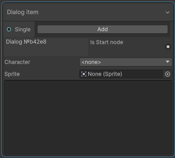
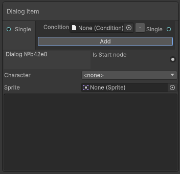
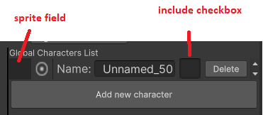
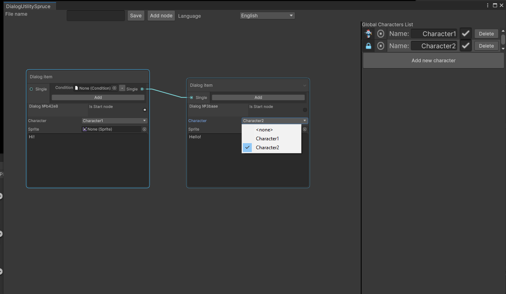
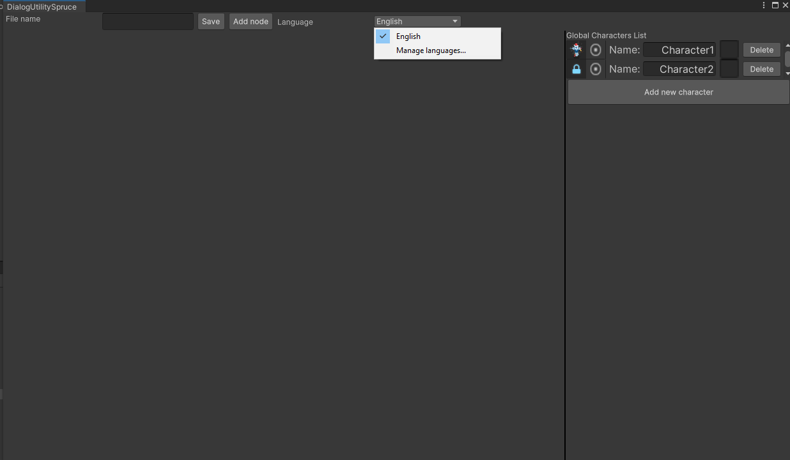
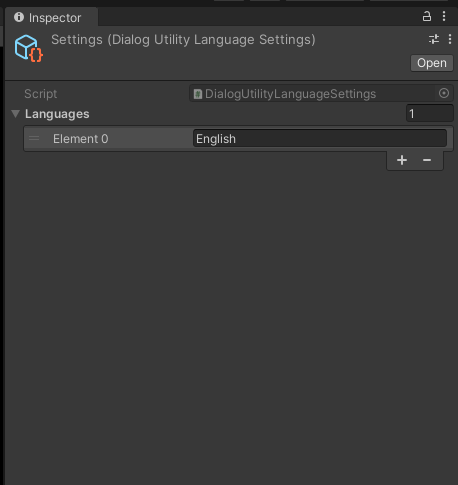
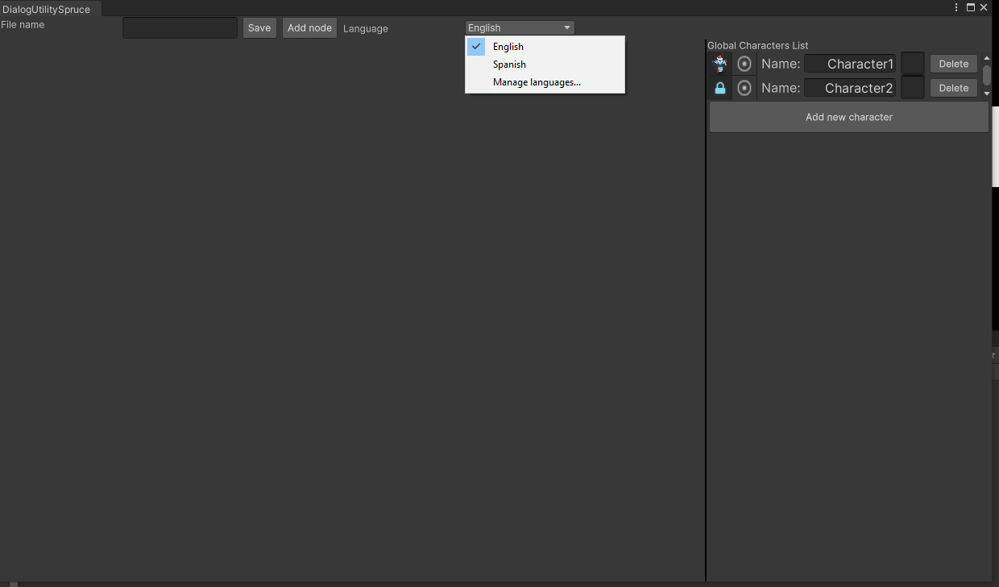

# DialogUtilitySpruce
DialogUtility “Spruce” usage guide

**Creating Dialog**

Click Window->DialogUtilitySpruce to open utility window.

Use File name text field on the top to set name of the dialog. All related files (localisation) will be name base on this value. Changing this value and pressing Save will always rename opened container, not create new one with different name!

Use Add Node or Right mouse button in graph area and Add in context menu to add nodes. Deleting nodes can be performed with same context menu or by pressing delete button on your keyboard. 

New dialog item will appear. Text field can be used to write dialog content. Add button will add dialog branching (dialog option paths). Each branch can use condition scriptable object defining option availability.  Use ‘-’ button to delete option. Use Sprite field to assign image to this dialog. Use Is Start node checkbox to set node as a start of a dialog.

**Creating and using Characters**

One of the main features of Spruce is the character list. Use Add new character button to create new character. Use Sprite field to set character sprite (good for icons or any other related things). Use Name textfield to set characters name. Use Include checkbox to include this character into the current dialog. Use the delete button to delete character.

Each character included in dialog now can be used in dialog:

**Adding localisation:**

You can set different text field values for different language open language dropdown and click “Manage languages”

Inspector will show language settings object,that includes list with all languages:

You can add new languages there, they will appear in languages dropdown:

Switching languages will switch current localisation. **By default all values from previous localisation will be copied for new localisation!**

**Scripting**

Use DialogReader class to read dialog containers. Take a look at DialogBox as an example.

Derive from Condition class top create your own conditions. Take A look At SomethingExistsCondition as an example.

**Localization files:**

All localization files are stored separately in Resources/DialogUtility/ContainerLocalizations. You can add to build only localizations required with addressables/assetbundles. Spruce will load only localisation defined in DialorReaderSettings. You can Init localisation settings manually, currently its done in DialogReader Awake.You can move Init anywhere you want, but it has to be performed before BeginDialog.
